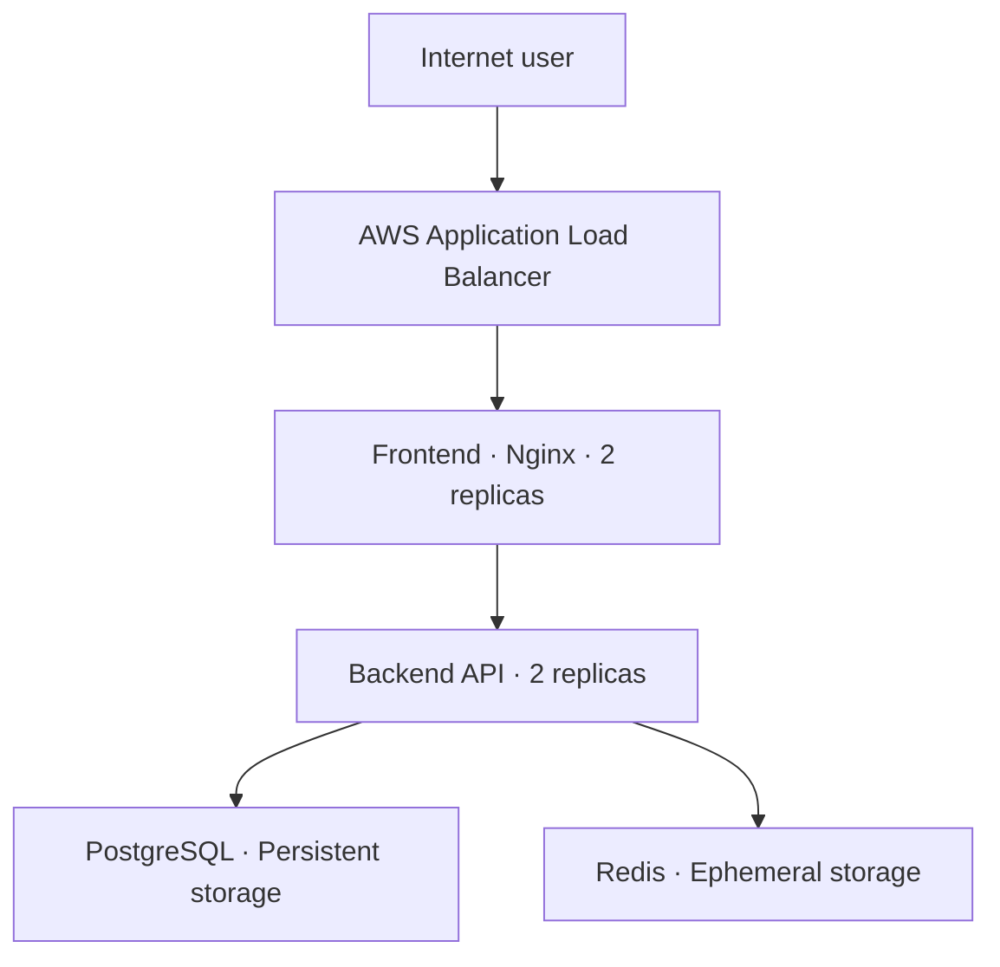

# Three-Tier EKS GitOps

[](https://kubernetes.io/)
[](https://argo-cd.readthedocs.io/)
[](https://kubectl.docs.kubernetes.io/guides/introduction/kustomize/)

The Kubernetes desired-state repository for deploying a three-tier application to Amazon EKS through Argo CD.

This repository contains the development Kubernetes configuration, immutable application image references, and Argo CD bootstrap resources required for continuous reconciliation.

## Architecture



## Repository model

The platform is separated into three repositories with distinct responsibilities:

| Repository | Responsibility |
| --- | --- |
| [`terraform-aws-eks-gitops-platform`](https://github.com/TechWorld707/terraform-aws-eks-gitops-platform) | Provisions the AWS infrastructure, Amazon EKS cluster, container repositories, identity controls, and initial platform add-ons |
| [`three-tier-eks-application`](https://github.com/TechWorld707/three-tier-eks-application) | Stores the frontend and API source code, tests, database migrations, and container definitions |
| [`three-tier-eks-gitops`](https://github.com/TechWorld707/three-tier-eks-gitops) | Defines the desired Kubernetes application state continuously reconciled by Argo CD |

## Repository structure

```text
.
├── apps/
│   └── dev/
│       ├── kustomization.yaml
│       └── stack.yaml
├── bootstrap/
│   └── dev/
│       └── argocd.yaml
└── README.md
```

### `apps/dev`

Contains the desired Kubernetes state for the development application stack.

### `bootstrap/dev`

Contains the Argo CD project and Application configuration used to connect the cluster to this repository.

## Development stack

The development environment deploys:

- Two frontend replicas
- Two backend replicas
- One PostgreSQL replica with persistent storage
- One Redis replica with ephemeral storage
- Internal Kubernetes Services
- AWS Load Balancer Controller Ingress
- Liveness and readiness probes
- CPU and memory requests
- CPU and memory limits
- Commit-specific application images

## Container images

The application images are published to GitHub Container Registry:

```text
ghcr.io/techworld707/three-tier-backend
ghcr.io/techworld707/three-tier-frontend
```

The manifests use commit-specific image tags instead of relying on the mutable `latest` tag.

This provides traceability between:

- Application source code
- GitHub Actions builds
- Published container images
- GitOps deployment changes
- Running Kubernetes workloads

## GitOps behaviour

Argo CD monitors:

```text
apps/dev
```

on the `main` branch.

The configured reconciliation process:

- Applies desired-state changes
- Detects configuration drift
- Repairs drift
- Prunes resources removed from Git
- Creates the application namespace
- Reports application synchronization and health status

Git remains the source of truth. Direct changes made to the cluster may be reverted by Argo CD if they are not represented in this repository.

## Delivery workflow

The intended delivery process is:

1. A developer changes code in `three-tier-eks-application`.
2. GitHub Actions validates the application.
3. The frontend and backend images are built.
4. Images are published to GHCR using commit-specific tags.
5. The required image references are updated in this repository.
6. The GitOps change is reviewed and merged.
7. Argo CD detects the desired-state change.
8. Argo CD synchronizes the application with Amazon EKS.
9. Kubernetes performs the configured rollout.
10. Application health is verified.

This separates application builds from deployment approval and creates an auditable deployment history.

## Local validation

### Render the development configuration

```bash
kubectl kustomize apps/dev
```

The command should render the complete development configuration without errors.

### Validate the rendered Kubernetes resources

```bash
kubectl kustomize apps/dev |
  kubectl apply \
    --dry-run=client \
    --filename=-
```

### Validate the Argo CD bootstrap resources

```bash
kubectl apply \
  --dry-run=client \
  --filename=bootstrap/dev/argocd.yaml
```

### Check repository formatting

```bash
git diff --check
```

These checks do not require the AWS environment to be running.

## Deployment

The AWS infrastructure, Amazon EKS cluster, and Argo CD installation must exist before deployment.

### Configure Kubernetes access

```bash
aws eks update-kubeconfig \
  --region us-east-1 \
  --name three-tier-eks-dev \
  --profile three-tier-admin
```

Confirm access:

```bash
kubectl get nodes
kubectl get pods --all-namespaces
```

### Bootstrap the Argo CD application

```bash
kubectl apply -f bootstrap/dev/argocd.yaml
```

Argo CD will then deploy and reconcile the resources under:

```text
apps/dev
```

## Deployment verification

Check the Argo CD Application:

```bash
kubectl get applications -n argocd
```

Inspect its synchronization and health status:

```bash
kubectl describe application -n argocd
```

Check application resources:

```bash
kubectl get deployments
kubectl get pods
kubectl get services
kubectl get ingress
kubectl get persistentvolumeclaims
```

Check rollout status using the deployment names rendered from `apps/dev`:

```bash
kubectl rollout status deployment/FRONTEND_DEPLOYMENT_NAME
kubectl rollout status deployment/BACKEND_DEPLOYMENT_NAME
```

Replace the placeholders with the actual deployment names.

## Image updates

Update the frontend and backend image tags in the desired-state configuration using the approved application commit SHA.

Use a clear commit message, for example:

```text
deploy(dev): update application images to commit SHA
```

After merging, verify that Argo CD synchronizes the change and that both deployments complete successfully.

## Rollback

Rollback is performed through Git:

1. Identify the last known-good GitOps commit.
2. Revert the deployment change.
3. Push or merge the revert.
4. Allow Argo CD to reconcile the cluster.
5. Confirm the application returns to a healthy state.

Example:

```bash
git log --oneline
git revert COMMIT_SHA
git push
```

This preserves an auditable record of the failed deployment and its rollback.

## Development limitations

This configuration intentionally prioritizes a simple, cost-conscious development environment:

- PostgreSQL runs inside Kubernetes rather than Amazon RDS.
- Redis runs inside Kubernetes rather than Amazon ElastiCache.
- Redis data is ephemeral.
- The database credential is development-only.
- The Ingress does not configure a custom domain.
- The Ingress does not configure a TLS certificate.
- The development environment does not represent a complete production security model.

A production implementation should consider:

- Managed database and cache services
- External secret management
- TLS and managed certificates
- Backups and restore testing
- NetworkPolicies
- Multi-AZ data services
- Monitoring and alerting
- Disaster recovery
- Policy-as-code validation

## Cost-safe environment status

The AWS development infrastructure is not kept running continuously to avoid unnecessary cloud charges.

The Terraform, application, and GitOps repositories preserve the configuration required to rebuild the environment when further deployment testing is needed.

## Related repositories

- [Three-tier EKS application](https://github.com/TechWorld707/three-tier-eks-application)
- [Amazon EKS GitOps platform](https://github.com/TechWorld707/terraform-aws-eks-gitops-platform)
- [Three-tier EKS GitOps configuration](https://github.com/TechWorld707/three-tier-eks-gitops)

## Author

**Henry — TechWorld707**

DevOps and Platform Engineer focused on AWS, Kubernetes, Terraform, Docker, Ansible, CI/CD, and GitOps.

- [GitHub profile](https://github.com/TechWorld707)
- [Email](mailto:hento77@yahoo.com)
